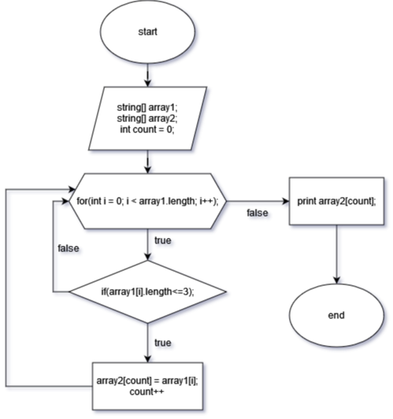

# First_grade_final task.
## Выполнение работы: 
1. Создать репозиторий на GitHub
2. Нарисовать блок-схему алгоритма
3. Оформить файл README.md
4. Написать программу, решающую задачу

**Задача:** Написать программу, которая из имеющегося массива строк формирует новый массив из строк, длина которых меньше, либо равна 3 символам. Первоначальный массив можно ввести с клавиатуры, либо задать на старте выполнения алгоритма. При решении не рекомендуется пользоваться коллекциями, лучше обойтись исключительно массивами.

## Описание алгоритма схемы и программы:
* Объявляем два массива и дополнительную переменную count.
* Объявляем метод и с помощью цикла for, пробегаем по длине массива 1.
* Если длина строк по условию совпадает, эту строку вносим в count массива 2. Если ничего не подходит по условию, count будет равен 0.
* Выводим массив 2 на печать.

## Схема алгоритма задачи:

